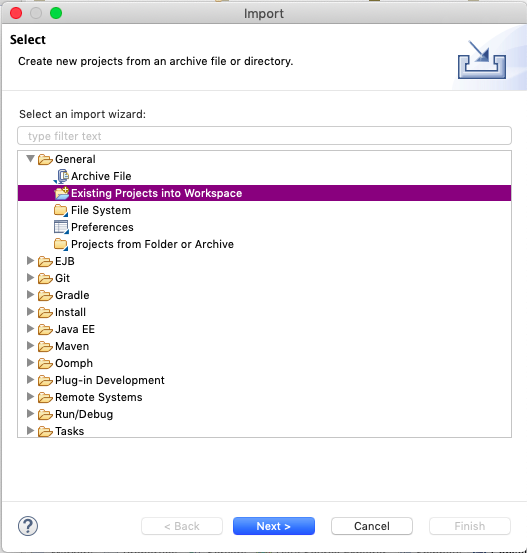
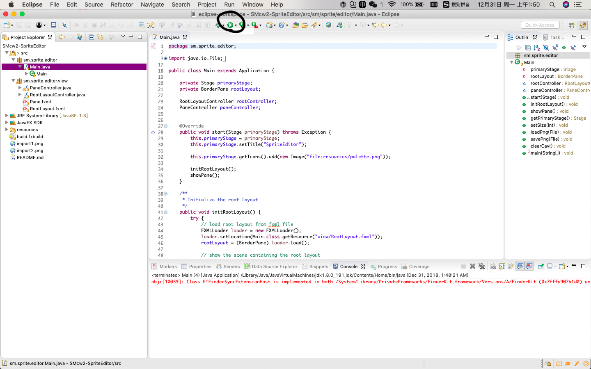
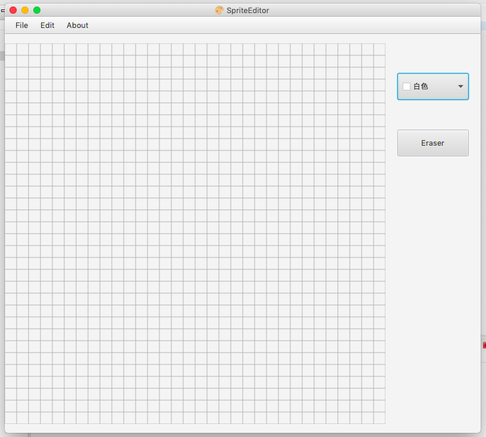

## Sprite Editor
A graphics editor

---
 

**How to import to eclipse**

`right click` -> `import` -> `General` -> `Existing Projects into Workspace`
  

`next` -> `Browse..` and select the src file to import 
  

**Run it**
  

  

